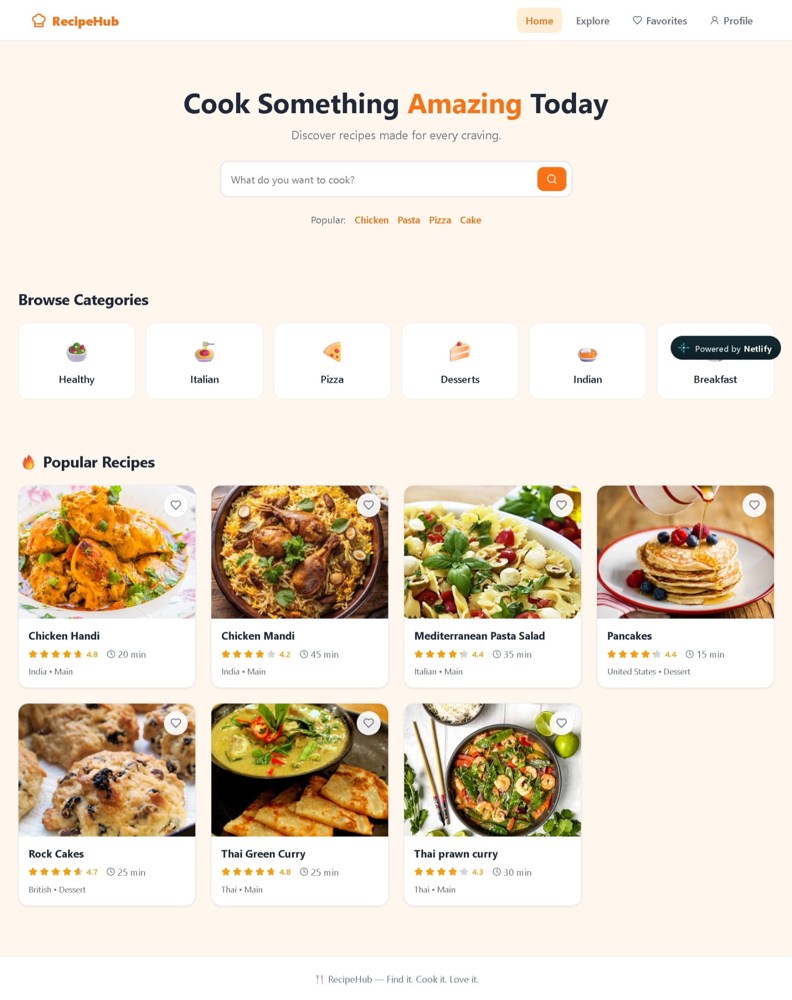
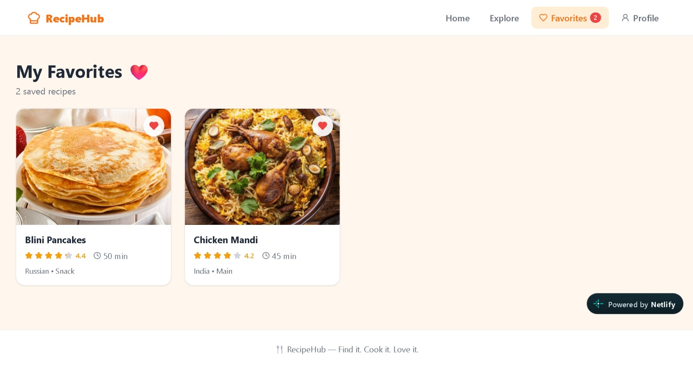
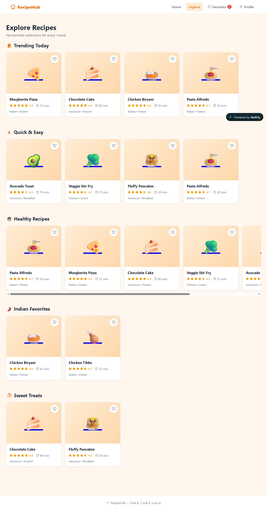

# 🍳 RecipeHub

> **Find it. Cook it. Love it.**

RecipeHub is a modern recipe discovery web application built with **React and Vite**. It provides a clean, food-focused interface for discovering recipes, browsing curated collections, searching for dishes, and saving favorites.

<p align="center">
  <a href="https://recipehub23.netlify.app/">
    
  </a>
  <a href="https://github.com/vankayalavamsi/RecipeHub">
    
  </a>
</p>

<p align="center">
  
</p>

---

## 🌐 Live Demo

### [🚀 Open RecipeHub](https://recipehub23.netlify.app/)

Explore the deployed application and browse recipes directly in your browser.

---

## 📖 About

RecipeHub is designed to make recipe discovery simple and enjoyable.

The application combines a warm, minimal visual design with recipe cards, categories, search, favorites, and dedicated exploration views. The interface is built as a client-side React application with reusable components and page-based navigation.

The current experience includes:

- Recipe discovery
- Recipe search
- Popular recipe collections
- Category browsing
- Explore sections
- Favorites
- Profile navigation
- Recipe ratings and cooking times
- Responsive interface
- Client-side routing

---

# ✨ Features

## 🏠 Home

The home page acts as the starting point for discovering recipes.

It includes:

- A prominent recipe search field
- Popular search suggestions
- Browse-by-category cards
- Popular recipes
- Recipe ratings
- Estimated cooking times
- Cuisine and meal-type information
- Favorite controls

### Categories shown in the interface

- 🥗 Healthy
- 🍝 Italian
- 🍕 Pizza
- 🍰 Desserts
- 🍛 Indian
- 🍳 Breakfast

---

## 🔎 Recipe Search

RecipeHub provides a dedicated search experience from the home interface.

Users can enter what they want to cook and quickly start exploring relevant recipes.

Popular suggestions are also displayed to make discovery faster.

---

## 🧭 Explore

The Explore page organizes recipes into curated collections.

Current sections visible in the application include:

- 🔥 Trending Today
- ⚡ Quick & Easy
- 🥗 Healthy Recipes
- 🌶️ Indian Favorites
- 🍰 Sweet Treats

This creates a browsing experience that feels more like a recipe shelf than a giant spreadsheet of dishes.

---

## ❤️ Favorites

RecipeHub includes a dedicated Favorites section for saved recipes.

The Favorites page displays:

- Number of saved recipes
- Saved recipe cards
- Recipe ratings
- Cooking time
- Cuisine
- Meal type
- Favorite state

---

## 🍽️ Recipe Cards

Recipe cards present useful information at a glance:

- Recipe image
- Recipe name
- Rating
- Cooking time
- Cuisine
- Meal type
- Favorite action

This keeps the browsing experience compact while still giving users enough information to decide what to cook.

---

## 👤 Profile Navigation

The main navigation includes a Profile section, providing a clear entry point for user-related functionality.

---

## 📱 Responsive UI

The application is designed as a responsive frontend experience, with layouts intended to work across different screen sizes.

---

# 🖥️ Screenshots

## 🏠 Home

<p align="center">
  
</p>

The home page introduces RecipeHub with a search-focused hero area, popular search terms, recipe categories, and a collection of popular recipes.

---

## ❤️ Favorites

<p align="center">
  
</p>

The Favorites page provides a focused view of saved recipes and their key details.

---

## 🔥 Explore

<p align="center">
  
</p>

The Explore page groups recipes into themed collections such as Trending Today, Quick & Easy, Healthy Recipes, Indian Favorites, and Sweet Treats.

---

# 🎨 Design

RecipeHub uses a warm culinary-inspired interface with:

- Orange as the primary accent color
- Soft cream backgrounds
- White recipe cards
- Rounded corners
- Large food imagery
- Clear typography
- Compact recipe metadata
- Heart-based favorite interactions
- Simple navigation
- Generous spacing

The visual direction keeps the interface approachable and food-focused without overwhelming the user with information.

---

# 🛠️ Tech Stack

| Technology | Purpose |
| --- | --- |
| ⚛️ **React 18** | Building the user interface |
| ⚡ **Vite 6** | Development server and build tooling |
| 🧭 **React Router 6** | Client-side page navigation |
| 🖼️ **Lucide React** | Interface icons |
| 📦 **npm** | Dependency management |
| 🚀 **Netlify** | Deployment |

The repository currently specifies React `18.3.1`, React Router DOM `6.28.0`, Lucide React `0.469.0`, and Vite `6.0.0`.

---

# 🏗️ Application Architecture

RecipeHub follows a component-based React architecture.

```text
RecipeHub/
│
├── public/
│
├── src/
│   ├── assets/
│   ├── components/
│   ├── pages/
│   ├── App.jsx
│   └── main.jsx
│
├── index.html
├── package.json
├── package-lock.json
├── vite.config.js
└── README.md
```

The repository currently organizes the application around reusable components and page-level views.

---

# 🚀 Getting Started

## Prerequisites

Make sure you have the following installed:

- **Node.js** 18+
- **npm**
- **Git**

Check your versions:

```bash
node --version
npm --version
git --version
```

---

## 1. Clone the repository

```bash
git clone https://github.com/vankayalavamsi/RecipeHub.git
```

## 2. Navigate into the project

```bash
cd RecipeHub
```

## 3. Install dependencies

```bash
npm install
```

## 4. Start the development server

```bash
npm run dev
```

Vite will provide a local development URL, typically:

```text
http://localhost:5173
```

The current repository uses Vite's standard `dev` script.

---

# 📦 Production Build

Create an optimized production build:

```bash
npm run build
```

Preview the production build locally:

```bash
npm run preview
```

---

# 📜 Available Scripts

| Command | Description |
| --- | --- |
| `npm run dev` | Starts the Vite development server |
| `npm run build` | Creates the production build |
| `npm run preview` | Previews the production build locally |

These scripts are defined in the repository's `package.json`.

---

# 🌍 Deployment

RecipeHub is deployed using **Netlify**.

### Live application

**https://recipehub23.netlify.app/**

The GitHub repository also links to this deployed application.

For a production deployment, build the application with:

```bash
npm run build
```

The generated `dist/` directory can then be deployed to a static hosting provider such as Netlify.

---

# 🎯 Project Goals

RecipeHub was created to explore and demonstrate:

- Component-based React development
- Client-side routing
- Reusable UI components
- Recipe discovery UX
- Search-oriented interfaces
- Favorites interactions
- Responsive layouts
- Modern frontend development with Vite
- Frontend deployment with Netlify

The project repository identifies practical React development, clean UX, component architecture, routing, responsiveness, and deployment as its core goals.

---

# 🔮 Future Improvements

Potential improvements for future versions include:

- [ ] Advanced recipe search and filtering
- [ ] More detailed recipe pages
- [ ] Ingredient-based search
- [ ] Dietary preference filters
- [ ] Recipe ratings and reviews
- [ ] User-submitted recipes
- [ ] Recipe creation and editing
- [ ] Shopping-list generation
- [ ] Persistent user accounts
- [ ] Persistent favorites across devices
- [ ] Dark mode
- [ ] Improved mobile navigation
- [ ] Backend/API integration
- [ ] Automated testing

> Some of these ideas are already listed as future improvements in the repository. The screenshots demonstrate that categories, favorites, and search-oriented UI are already part of the visible application experience, so they are not presented here as purely future features.

---

# 🤝 Contributing

Contributions, suggestions, and improvements are welcome.

### Fork the repository

```bash
git clone https://github.com/vankayalavamsi/RecipeHub.git
cd RecipeHub
npm install
```

Create a feature branch:

```bash
git checkout -b feature/your-feature-name
```

Make your changes and commit them:

```bash
git add .
git commit -m "feat: add your feature"
```

Push your branch:

```bash
git push origin feature/your-feature-name
```

Then open a Pull Request on GitHub.

---

# 🐛 Reporting Issues

If you find a bug or have an improvement idea, open an issue in the repository:

**https://github.com/vankayalavamsi/RecipeHub/issues**

A useful issue should include:

1. A clear description
2. Steps to reproduce the problem
3. Expected behavior
4. Actual behavior
5. Browser/device information
6. Screenshots or console errors where relevant

---

# 📄 License

The repository currently does **not specify a license**.

If you intend to distribute RecipeHub as an open-source project, add an appropriate `LICENSE` file to the repository and update this section.

---

# 👨‍💻 Author

**Vamsi Vankayala**

- GitHub: [@vankayalavamsi](https://github.com/vankayalavamsi)
- Repository: https://github.com/vankayalavamsi/RecipeHub
- Live Demo: https://recipehub23.netlify.app/

---

<div align="center">

## 🍴 RecipeHub

**Find it. Cook it. Love it.**

Built with ❤️ using React and Vite.

⭐ If you find the project useful, consider giving the repository a star.

</div>
